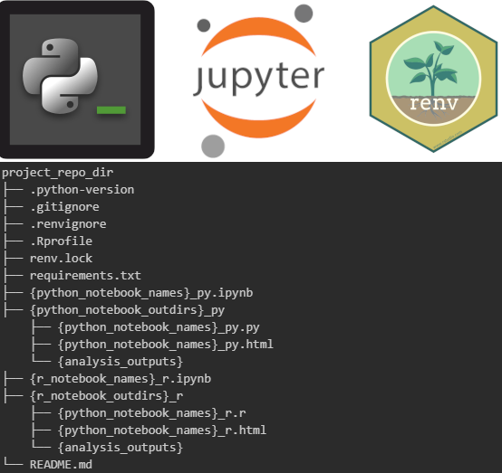
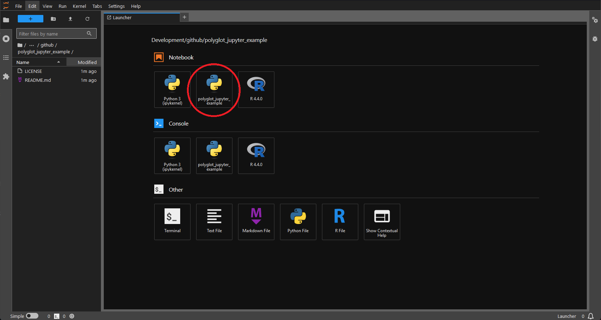

# polyglot_jupyter_example
An example of setting up a minimal environment for both R and Python in a 
bioinformatics/data science Jupyter project.



I am not a graphic designer.

## Purpose

Sometimes you might really like a python library, sometimes you might prefer
an R package, for a given task. Sometimes, packages are only available in one
or the other (I'm looking at you [Bioconductor](https://bioconductor.org/)).

This isn't the only way to solve this issue and create documented environments,
but this solution is pretty minimal in terms of requirements. It does, however,
require being a bit adventurous and some experimentation. This works best when
each project is the level at which environments and git repos are created.

## Requirements

To follow this, in no particular order:

1. [Pyenv](https://github.com/pyenv/pyenv)
   - To install user-specific versions of python
   - Don't use your system python
2. [Pyenv-virtualenv](https://github.com/pyenv/pyenv-virtualenv)
   - To allow pyenv to manage python virtualenvs
3. [R](https://www.r-project.org/)
   - May I recommend installing it with [rig](https://github.com/r-lib/rig)
4. Some form of *nix operating system
   - Tested on Ubuntu through WSL2 and Manjaro/Arch

## Initial Set-up

1. Install your desired version of python.
   - Make sure to use `--PYTHON_CONFIGURE_OPTS="--enable-shared` at a minimum.
   - The full command with pyenv that I use at the time of writing this is:
    `env PYTHON_CONFIGURE_OPTS="--enable-shared --enable-optimizations --with-lto" PYTHON_CFLAGS='-march=native -mtune=native' pyenv install 3.12.3`
2. Set your global version of python to the one you just installed.
   - `pyenv global 3.12.3`
3. Install jupyterlab to that global python version.
   - `pip install jupyterlab`
4. Make sure you have R installed, and then install the R kernel for jupyter.
   - Follow the directions [here](https://irkernel.github.io/installation/)
5. Install in R [renv](https://rstudio.github.io/renv/index.html)
   - `install.packages("renv")`
6. Proceed to setting up Python and R environments in this project.

## Set-up the Python virtualenv

1. Make sure you're in the project/github repo directory.
2. Set a version of python in the current project folder.
   - `pyenv local 3.12.3`
3. Create a virtualenv, I just name them the same as the project.
   - `pyenv virtualenv polyglot_jupyter_example`
4. Activate the virtualenv. You don't have to stay in the directory you made, but it keeps things simple.
   - `pyenv activate polyglot_jupyter_example`
5. Install a minimal subset of packages needed for this example.
   - `pip install ipykernel pandas seaborn`
6. Add the ipykernel you installed in the virtualenv to your jupyter that's **outside** the virtualenv.
   - `python -m ipykernel install --user --name=polyglot_jupyter_example`
7. Exit the virtualenv
   - `pyenv deactivate`
   - Don't worry, jupyter will still know about it.
8. Start jupyter and you'll see that you can now create notebooks inside the virtualenv.

**Important Note:** If you're used to installing pip packages, etc. within a
notebook by `! pip install {package}` you'll need to adjust your workflow. The
shell that spawns does not know about your virtualenv. Just keep a terminal
open outside the notebook.



## Set-up the Renv

This is somewhat easier, because R isn't controlling jupyter.

1. Inside the project directory, start R.
   - `R`
2. Initialize an renv.
   - `renv::init(bare = TRUE)`
   - `bare = TRUE` keeps renv from parsing all text files in the project, if you're starting a
     project and it's not a blank slate (you have large notebooks and other files in it) this can cause renv to hang.
   - This creates a project-specific library, a `.Rprofile`, and `renv.lock` amongst other things.
3. Exit R, and add configure bioconductor if you use it
   - Setup information for the posit package manager mirror of bioconductor: [here](https://packagemanager.posit.co/client/#/repos/bioconductor/setup)
4. Enter R again and install the ir kernel and data science stack.
   - `install.packages(c("tidyverse", "IRkernel"))`
5. Make sure the R kernel is installed in jupyter outside the renv.

As long as you start your jupyter notebooks in the top level of the project folder then R kernels
will respect your Renv.

## Project Structure

```
project_repo_dir
├── .python-version
├── .gitignore
├── .renvignore
├── .Rprofile
├── renv.lock
├── requirements.txt
├── {python_notebook_names}_py.ipynb
├── {python_notebook_outdirs}_py
    ├── {python_notebook_names}_py.py
    ├── {python_notebook_names}_py.html
    └── {analysis_outputs}
├── {r_notebook_names}_r.ipynb
├── {r_notebook_outdirs}_r
    ├── {python_notebook_names}_r.r
    ├── {python_notebook_names}_r.html
    └── {analysis_outputs}
└── README.md
```

## Notes on .gitignore and .renvignore

By default renv will parse all files in your project to determine which
packages need to be tracked in the `renv.lock`. This can be problematic if you
have large files, including notebooks in the project folder.

One way around them is to add these to `.gitignore`. Renv respects that as a list
of files and subdirectories not to parse. You'll notice this already will exist
in the `./renv/` subdirectory it creates your project-specific library in to
avoid having git track all that. This probably isn't sufficient to avoid having
issues with it parsing notebooks, which you likely *do* want to track with git.

If you create an `.renvignore` in your project folder then Renv will use that
*instead* of `.gitignore`. So, you can have renv ignore anything you want, I
have been naming notebooks I write python in with `_py` on the end so I can
match them and output folders in `.renvignore` easily. This is kind of clunky
though.

In light of this I set up my `.gitignore` with typical settings from jupyter
notebooks like this: [.gitignore](.gitignore). Basically, only ignoring the
`.ipynb_checkpoints` and `.virtual_documents` folders.

For `.renvignore` I create one that ignores all python-based notebooks. You may
want to tweak this to your liking: [.renvignore](.renvignore). You can get
around the behavior of renv trying to parse large files by forcing it to record
**all** packages *installed* in an environment rather than just ones *used* and
their dependencies. This is demonstrated in the R notebook example with
`renv::snapshot(type = "all")`.

## Notes on Alternative Setups

There is more than one way to do this. [Poetry](https://python-poetry.org/) is
one attractive option, but I decided against this as it's another dependency. I
intended this as a minimal example of such a setup depending only on Python, R,
virtualenvs (python, through pyenv), and renv(R). Some will prefer to opt for
[conda](https://conda.io) environments instead, since there is some support for
R. Anaconda is pretty heavy and I'm not a fan, but miniconda is certainly an
option. [Mamba](https://github.com/mamba-org/mamba) is a great option to manage
conda environments which is much faster. Again, this is more to configure, but
might also work well.

Then, there's the nuclear option of every environment being a standalone
[Docker](https://www.docker.com/) or [Podman](https://podman.io/) container.
This is attractive when you don't need to interact with a host system, and
therefore is a good fit for working in "the cloud." You still need to document
your environments though in case you need to recreate them.

This is not the only way to set-up such an environment, and there are probably
improvements I'll add over time. It works for me at the moment though.